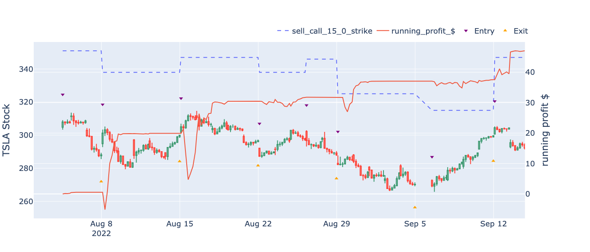

# Options Backtest

A tool to implement and backtest options strategies on simulated or historical data using QuantConnect


## Installation

`pip install -e .`

## Linking to QuantConnect
Based of these instructions
https://www.quantconnect.com/docs/v2/lean-cli/projects/libraries/project-libraries

```
cd /Users/username/options_backtest
lean project-create "Library/optionsbacktest" --language python # can't have an underscore in the name on quantconnect
cp /Users/username/options_backtest/src/options_backtest/* ./Library/optionsbacktest 
lean library add 'Backtest 20230601' 'Library/optionsbacktest'
```

### Remote -> local
```
lean cloud pull --project 'Backtest 20230601'
cp ./Library/optionsbacktest /Users/username/options_backtest/src/options_backtest/*
```

### local -> remote
```
cp /Users/username/options_backtest/src/options_backtest/* ./Library/optionsbacktest
lean library add "Backtest 20230601" "Library/optionstesting"
lean cloud push --project 'Backtest 20230601'
```

## Usage

```
from options_backtest.qc_simulator import QuantBook, Resolution, OptionRight
import options_backtest.quantconnect as qc
from options_backtest.strategies import measure_period_profit, LegMeta, StrategyBase
import options_backtest.plots as plots

qbw = qc.QuantBookWrapper({'qb':QuantBook(),'Resolution':Resolution,'OptionRight':OptionRight})
tsla = qbw.get_tsla(200)
legs = [LegMeta(trans='sell', contract='call', strike_offset= 15, exp_offset= 0),]  
strat = StrategyBase(qbw=qbw, legs=legs)
ic = measure_period_profit(tsla,  strat)
plots.plot_candles_and_profit(ic, lines=[f'{l.name}_strike' for l in strat.legs])
```


## License
GNU Affero General Public License